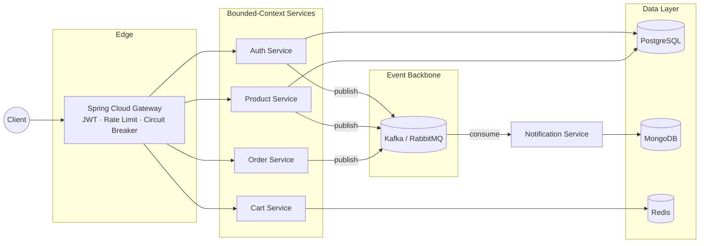

<div align="center">


<a href="https://github.com/sanan011">
  
</a>

<br/>

<a href="https://linkedin.com/in/sanan-yagubov-6b9b04284"></a>
<a href="https://github.com/sanan011?tab=repositories"></a>


</div>

<br/>

## About

I'm a third-year Computer Engineering student at **Baku Higher Oil School (BHOS)**, Azerbaijan, graduating in 2027, focused on **backend development, distributed systems, and cloud-native architecture**.

My work centers on **Java 21 and the Spring ecosystem** — building REST APIs and microservices that take reliability seriously: idempotency, circuit breakers, dead-letter queues, and observability aren't afterthoughts, they're part of the design from day one. Recent work spans a self-initiated event-driven marketplace platform (Kafka, Eureka, Elasticsearch), a delivered production microservices system from an internship at Unibank ASC, and an active CRUD API build at DevJoint.

I hold an **IBM Java Professional Certificate** and I'm working toward graduate study abroad in distributed systems / backend engineering.

```
role        : Backend Engineer (in progress) — Java · Spring Boot · Microservices
currently   : Backend Development Intern @ DevJoint
based_in    : Azerbaijan
studying    : Computer Engineering, BHOS — Class of 2027
focus       : REST APIs · Microservices · Event-driven systems · Cloud-native patterns
```

<br/>

## Tech Stack

**Languages**


**Frameworks & Libraries**


**Databases & Messaging**


<br/>


**Cloud-Native & DevOps**


<br/>


**Tools**


<br/>

## Architecture

The pattern below recurs across my microservices work (`smartorder`, `unibank-smartorder`): a reactive gateway at the edge, independently deployable services per bounded context, and an event backbone that decouples producers from consumers.



Discovery (Eureka), centralized config (Spring Cloud Config), and distributed tracing (Zipkin/Micrometer) sit alongside this as cross-cutting infrastructure. Every service owns its data store — no shared database across bounded contexts.

<br/>

## Featured Projects

<table>
<tr>
<td width="50%" valign="top">

### [SmartOrder — Unibank Edition](https://github.com/sanan011/unibank-smartorder)

Production-grade order management platform delivered during a one-month backend internship at **Unibank ASC**. Three services (order, payment, notification) communicating over RabbitMQ, with a React/TypeScript storefront.

**Reliability patterns:** SAGA · Outbox · Idempotency · Circuit Breaker · Dead Letter Queue · Redis-backed rate limiting · JWT/RBAC

**Delivered:** 22 passing tests, 8/8 green CI checks (build-test, code-quality, security-scan), Prometheus + Grafana monitoring, k6 load tests, tagged `v1.0.0`.

`Java 21` `Spring Boot 3.3` `PostgreSQL` `MongoDB` `Redis` `RabbitMQ` `Docker` `React` `TypeScript`

</td>
<td width="50%" valign="top">

### [SmartOrder — Platform Architecture](https://github.com/sanan011/smartorder)

A more ambitious, self-directed exploration of the same domain: a multi-module, **event-driven marketplace** built around Domain-Driven Design and Hexagonal Architecture, with a full service mesh.

**Infrastructure:** Eureka discovery · Spring Cloud Config · reactive WebFlux Gateway · Kafka event bus · Elasticsearch product search · MinIO object storage · Zipkin tracing · Next.js 14 storefront.

Where the Unibank build is the shipped, tested deliverable, this is the architecture sandbox — the version where new patterns get tried first.

`Java 21` `Spring Cloud` `Kafka` `Elasticsearch` `Next.js 14` `Gradle`

</td>
</tr>
<tr>
<td width="50%" valign="top">

### [Library Management API](https://github.com/sanan011/library-management-api)

Currently in progress — first assigned task in the **DevJoint** backend internship. A layered CRUD REST API (Author, Book, Member, Loan) with strict architectural discipline: DTOs on every boundary, centralized exception handling, pagination and sorting, and full Swagger documentation.

`Java 21` `Spring Boot 3.3` `Spring Data JPA` `PostgreSQL` `MapStruct` `Lombok`

</td>
<td width="50%" valign="top">

### [JWT Authentication API](https://github.com/sanan011/jwt-auth-api)

A focused, standalone Spring Security service — registration, login, token refresh, and role-based access control, with deliberate handling of the 401-vs-403 distinction that a lot of auth demos get wrong.

`Java 21` `Spring Boot 3.3` `Spring Security` `MySQL` `JJWT`

</td>
</tr>
<tr>
<td width="50%" valign="top">

### [Least-Privilege Advisor](https://github.com/sanan011/least-privilege-advisor)

A zero-dependency Python CLI that statically analyzes IAM-style JSON policies — flags wildcard grants, detects privilege-escalation chains, scores overall risk 0–100, and outputs a minimized policy plus a self-contained HTML report.

`Python` `Static Analysis` `Security Tooling`

</td>
<td width="50%" valign="top">

### [Java Database Capstone](https://github.com/sanan011/java-database-capstone)

Capstone project — a Smart Clinic Management System — applying relational database design and JDBC/Spring Data fundamentals to a real scheduling-and-records domain.

`Java` `Spring Boot` `SQL`

</td>
</tr>
</table>

<br/>

## GitHub Stats

<div align="center">





</div>

<br/>

## Contribution Snake

<div align="center">

<picture>
  <source media="(prefers-color-scheme: dark)" srcset="https://raw.githubusercontent.com/sanan011/sanan011/output/github-contribution-grid-snake-dark.svg" />
  <source media="(prefers-color-scheme: light)" srcset="https://raw.githubusercontent.com/sanan011/sanan011/output/github-contribution-grid-snake.svg" />
  
</picture>

</div>

<br/>

## Career Timeline

<table>
<tr><th>When</th><th>Milestone</th></tr>
<tr><td><code>2024</code></td><td>Fullstack foundations — Cybernetics Academy Fullstack Developer Course (scholarship), plus C# systems coursework at the Institute of Management Systems. First public repositories in HTML/CSS/JS and C#.</td></tr>
<tr><td><code>Jun – Jul 2025</code></td><td>Software Developer Internship at <b>TÜBİTAK BİLGEM</b> (Istanbul) — built a real-time SDR (Software-Defined Radio) web application with React, Leaflet, and Python. Scored 100/100.</td></tr>
<tr><td><code>Dec 2025</code></td><td>Git & GitHub foundations project completed, opening the on-ramp into an IBM-affiliated certificate track.</td></tr>
<tr><td><code>Jan – Mar 2026</code></td><td><b>IBM Java Professional Certificate</b> completed via Azerbaijan's "Milli Proqram" (4SİM Akademiyası).</td></tr>
<tr><td><code>Mar 2026</code></td><td>Independent project: <code>least-privilege-advisor</code>, a Python IAM-policy security scanner.</td></tr>
<tr><td><code>Apr – Jun 2026</code></td><td>Deepened Java fundamentals; shipped the <code>java-database-capstone</code> clinic management system.</td></tr>
<tr><td><code>Jun 2026</code></td><td>Designed <code>smartorder</code> — a self-directed, event-driven microservices platform (Kafka, Eureka, Elasticsearch, Next.js).</td></tr>
<tr><td><code>Jun – Jul 2026</code></td><td>Backend internship at <b>Unibank ASC</b> — delivered <code>unibank-smartorder</code>, a tested, CI-green production microservices system.</td></tr>
<tr><td><code>Jul 2026 – present</code></td><td>Backend Development internship at <b>DevJoint</b> (scholarship-based, mentor-guided) — building <code>jwt-auth-api</code> and the in-progress <code>library-management-api</code>.</td></tr>
<tr><td><code>2027</code></td><td>Expected graduation, Computer Engineering, BHOS — targeting graduate study abroad in distributed systems / backend engineering.</td></tr>
</table>

<br/>

## Learning Roadmap

- [x] Core Java, OOP, and Spring Boot fundamentals
- [x] Layered REST API design — DTOs, validation, centralized exception handling
- [x] Relational + document + in-memory data modeling (PostgreSQL, MongoDB, Redis)
- [x] Messaging & event-driven patterns (Kafka, RabbitMQ, Outbox, SAGA)
- [x] Observability basics (Prometheus, Grafana, Zipkin tracing)
- [ ] Kubernetes-native deployment of the SmartOrder service mesh
- [ ] Deeper distributed-systems theory — consensus, consistency models, CAP trade-offs in practice
- [ ] Contributing to an open-source Spring / cloud-native project
- [ ] Graduate study abroad in backend engineering / distributed systems

<br/>

## Recent Activity

<!--START_SECTION:activity-->
_No recent public activity found._
<!--END_SECTION:activity-->

<br/>

## Latest Repositories

<!--START_SECTION:repos-->
| Repository | Language | Last Updated |
|---|---|---|
| [db-queries-api](https://github.com/sanan011/db-queries-api) | Java | Aug 02, 2026 |
| [sanan011](https://github.com/sanan011/sanan011) | Python | Aug 02, 2026 |
| [library-management-api](https://github.com/sanan011/library-management-api) | Java | Jul 27, 2026 |
| [jwt-auth-api](https://github.com/sanan011/jwt-auth-api) | Java | Jul 26, 2026 |
| [unibank-smartorder](https://github.com/sanan011/unibank-smartorder) | Java | Jun 30, 2026 |
<!--END_SECTION:repos-->

<br/>

<div align="center">


</div>

<br/>

## Connect

<div align="center">

<a href="https://linkedin.com/in/sanan-yagubov-6b9b04284"></a>
<a href="https://github.com/sanan011"></a>

</div>

<br/>


<div align="center">
<sub>Built with Java, Spring Boot, and a stubborn refusal to skip the tests.</sub>
</div>
